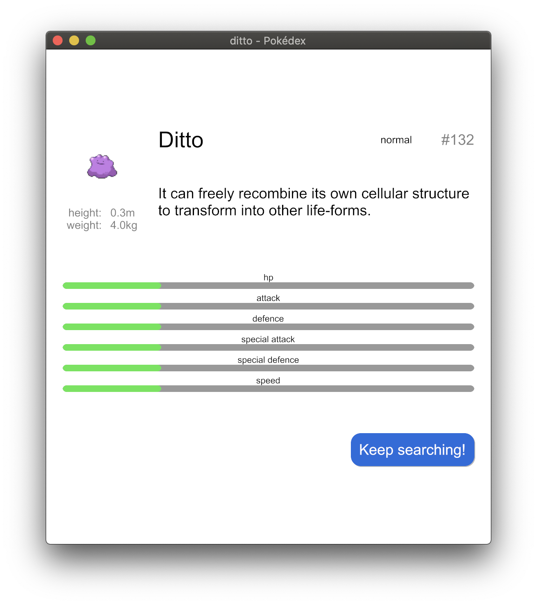

```
                 ______     _            _
                 | ___ \   | |          | |
                 | |_/ /__ | | _____  __| | _____  __
                 |  __/ _ \| |/ / _ \/ _` |/ _ \ \/ /
                 | | | (_) |   <  __/ (_| |  __/>  <
                 \_|  \___/|_|\_\___|\__,_|\___/_/\_\

```

A random Pokédex built using the [iced](https://github.com/hecrj/iced) crate. It's heavily inspired by this [example](https://github.com/hecrj/iced/tree/master/examples/pokedex).

<p float="middle">
  
  
</p>

# Quickstart

- Download the binary from [release](https://github.com/cowboy-bebug/pokedex-rs/releases/download/0.1.0/pokedex).

- Or build from source and run:
  ```bash
  % git clone https://github.com/cowboy-bebug/pokedex-rs.git
  % cd pokedex-rs
  % cargo run --release
  ```
